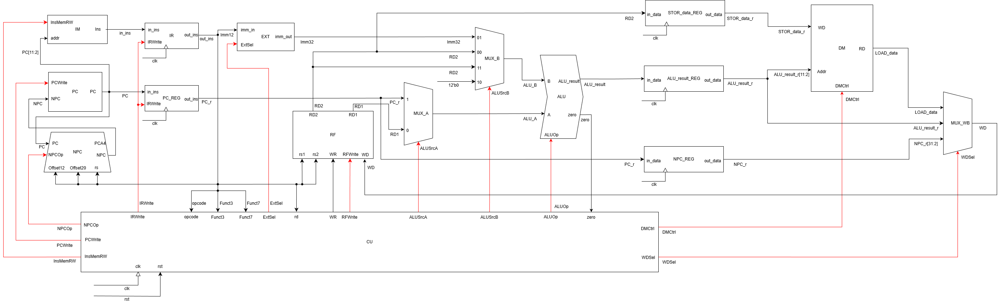
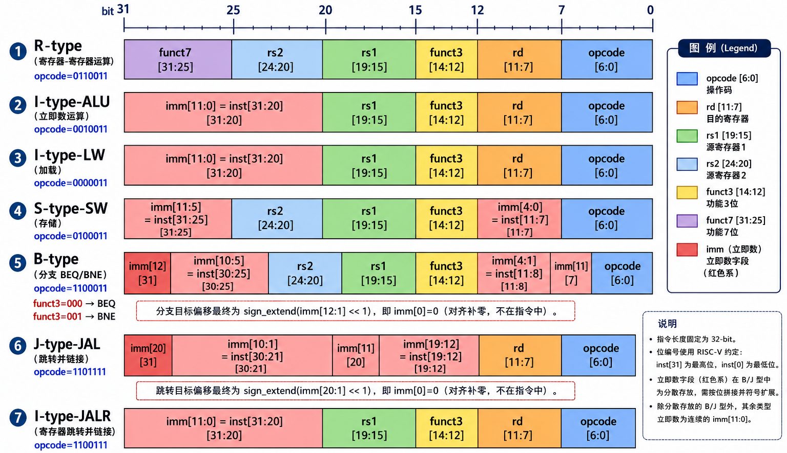

# 3CyclesLowPowerCPUdesign
本项目为3周期RISC-V指令集的CPU设计，荣获26年集成电路创新创业大赛地区三等奖，目前该CPU的功能已基本完备，适合新手了解CPU的结构或用于演示CPU的工作模式
## CPU总体架构
主办方“叩持”要求必须使用企业提供的模块，只有CU部分和顶层模块可修改，官方提供的模块难以实现完全的流水结构。
因此本芯片没有采用传统的流水式设计，而是采用多周期加流水的设计，R,I类指令流水执行，其余指令采用多周期模式处理
### CPU框架图

## RISC-V指令结构

